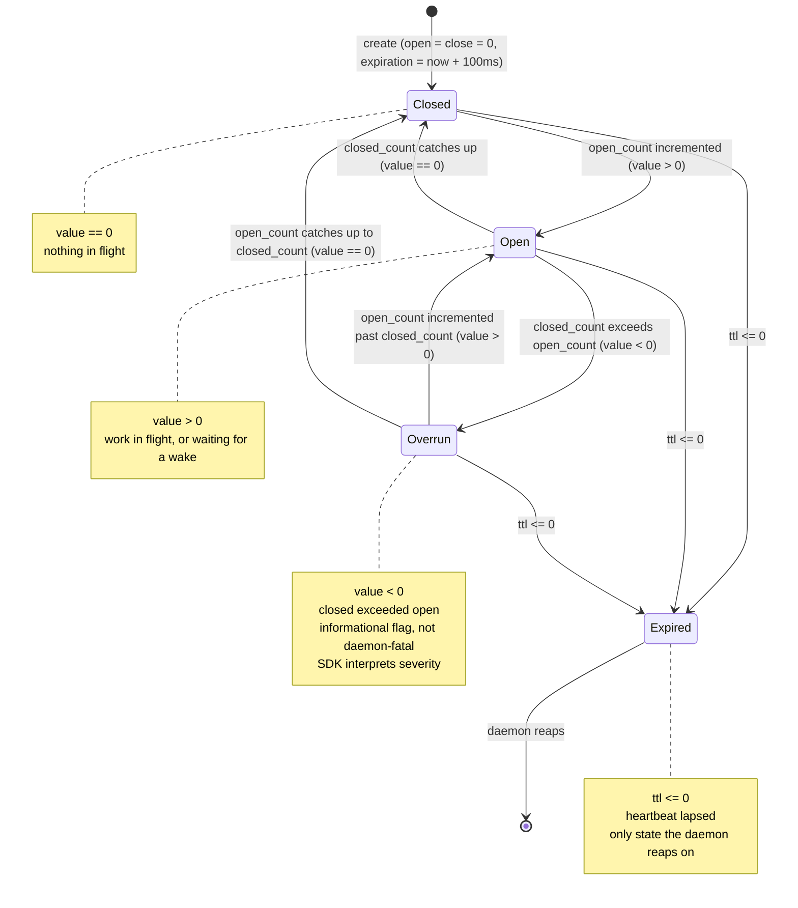

# Abacus state machine

The interlock is one primitive with one state machine. WaitCounter and WaitTimer are strict
supersets implemented as SDK composition over the same mechanism. The daemon evaluates the
state machine; the SDK interprets the results.

<the-state-machine>

## The state machine

Two stored counters and a TTL produce four derived states.

### Stored properties

| Word | Type | Name | Written by |
|------|------|------|------------|
| word 0 | u64 | open_count | owner (interlock), client (wait types) |
| word 1 | u64 | closed_count | owner (interlock), daemon (wait types) |
| word 2 | u64 | expiration_ns | owner via touch, SDK auto-touch on wait |

### Derived properties

| Name | Formula | Meaning |
|------|---------|---------|
| value | open_count - closed_count (signed) | positive = open, zero = closed, negative = overrun |
| ttl | expiration_ns - clock_ns (signed) | positive = alive, zero or negative = expired |

### States



| State | Condition | Daemon action |
|-------|-----------|---------------|
| InterlockState::Closed | value == 0, ttl > 0 | none |
| InterlockState::Open | value > 0, ttl > 0 | evaluate wait contract if type is WaitCounter, WaitTimer, WaitCron, or WaitBarrier |
| InterlockState::Overrun | value < 0, ttl > 0 | none (informational; SDK interprets severity) |
| InterlockState::Expired | ttl <= 0 | reap (write terminal marker, remove from registry) |

Overrun is a flag, not a daemon-fatal condition. The daemon does not reap on overrun. The SDK
reads value after wake and determines severity: within grace tolerance, or an error to surface.
For bare interlocks, overrun indicates an owner bug. For wait types, overrun indicates the
daemon was late (the watched value overshot the target).

</the-state-machine>

<daemon-evaluation>

## Daemon evaluation (every 1 ms cycle)

For every interlock in the registry, the daemon derives state and acts. One pass, not separate
reap and wake sweeps.

```
for each interlock:
    ttl = expiration_ns - clock_ns

    if ttl <= 0:                         -> reap
    else:
        value = open_count - closed_count
        if value > 0 AND type != None:   -> evaluate wait contract
        else:                            -> skip (Closed, Overrun, or bare Open)
```

### Wait contract evaluation

When an interlock is Open (value > 0) and has a wait type:

```
if type == WaitTimer:
    watched = clock.open_count (current monotonic ms)
    if watched >= open_count:
        closed_count = watched
        futex_wake(closed_count)

if type == WaitCounter:
    watched = target_interlock.{open_count | closed_count}  (per watched_word)
    if watched >= open_count:
        closed_count = watched
        futex_wake(closed_count)

if type == WaitCron:
    watched = clock.open_count (current monotonic ms)
    if watched >= open_count:
        closed_count = watched
        futex_wake(closed_count)
        open_count = next_grid_line(monotonic_epoch, interval, closed_count)
        // grid-aligned to monotonic epoch, no custom anchor
        // interlock stays Open, client futex_waits again, no UDS round-trip

if type == WaitBarrier:
    all_met = true
    for (watched_name, watched_word, threshold) in watched_list:
        if watched_interlock.{watched_word} < threshold:
            all_met = false
            break
    if all_met:
        closed_count = clock.open_count
        futex_wake(closed_count)
```

The daemon stamps closed_count to the actual watched value, not to open_count. If the watched
value overshot (watched > open_count), closed_count > open_count, value becomes negative, and
the next cycle reaps as Overrun. The SDK sees the overrun before the reap.

WaitCron auto-re-arms: after waking, it computes the next grid line from the anchor and
interval and sets open_count forward. The interlock never goes Closed between firings, so
the client just loops futex_wait without any create/attach overhead per cycle. Grid alignment
prevents phase drag: a late wake does not shift subsequent targets.

### Clock advancement

The system clock is an interlock the daemon owns, named "clock". It stores monotonic time and
daemon uptime in the same two words.

```
daemon start: clock.closed_count = monotonic_now_ms()   (start time, set once)
each cycle:   clock.open_count = monotonic_now_ms()      (current time, updated)
              futex_wake(clock.open_count)
```

- closed_count = daemon start monotonic ms (never changes)
- open_count = current monotonic time (updated every cycle)
- value = open_count - closed_count = daemon uptime in ms

WaitTimers and WaitCrons watch clock.open_count (the advancing time). Timer targets are
absolute monotonic timestamps. Attaching to "clock" gives current monotonic time, start time,
and uptime in one read.

The clock is never reaped (excluded from the sweep). Its expiration is refreshed every cycle.
The "clock" name is reserved; client create("clock") is rejected.

</daemon-evaluation>

<type-composition>

## Type composition

One primitive, three types, strict superset hierarchy:

```
Interlock (type None)
    daemon: reap on expired/overrun
    owner: reads and writes open_count, closed_count, expiration
    the base primitive

  +-- WaitCounter (type WaitCounter)
        daemon: reap + wake when watched interlock's word >= open_count
        client: writes open_count (the target), reads closed_count (the response)
        watches: another named interlock's open_count or closed_count
        superset: adds the daemon watch contract

      +-- WaitTimer (type WaitTimer)
            daemon: reap + wake when clock >= open_count
            client: writes open_count (target clock time), reads closed_count (actual)
            watches: clock.closed_count (always)
            superset: fixes the watched target to clock, SDK adds timeout-fatal semantics
```

WaitCounter is an interlock plus a daemon-evaluated watch. WaitTimer is a WaitCounter with a
fixed watch target (clock) and fatal timeout semantics. The daemon treats WaitCounter and
WaitTimer identically except for the auto-resolved watch target. The behavioral difference
(timeout is fatal for timers, owner-decided for counters) is SDK composition.

### Daemon-evaluated compositions

| Type | Daemon handler | Create fields | Auto-re-arm |
|------|---------------|---------------|-------------|
| WaitCron | wake on clock grid, re-arm to next grid line | interval_ns, anchor_ns | yes |
| WaitBarrier | wake when all conditions in list are met | [(watched_name, threshold)] | no |

WaitCron is a WaitTimer that auto-re-arms to the next grid line after every wake. The anchor
is set at creation; the interval is fixed. Grid alignment prevents phase drag: the next target
is `anchor + N * interval` where N is the next multiple, not `now + interval`.

WaitBarrier watches N interlocks, each at its own threshold. The daemon checks all N conditions
each cycle. When all are met, it stamps closed_count = clock.closed_count and wakes. The SDK
receives the barrier result; the completion order can be derived from the watched values.

### Boolean compositions (daemon-evaluated)

Open (value > 0) = 1, Closed (value == 0) = 0. Boolean algebra over interlock states:

| Type | Daemon check | Fires when |
|------|-------------|------------|
| WaitAnd | all watched are Open | all bits 1 |
| WaitOr | any watched is Open | any bit 1 |
| WaitXor | exactly one Open, rest Closed | XOR mask |
| WaitNand | all watched are Closed | all bits 0 |

These check instantaneous state, not cumulative thresholds. WaitBarrier checks "has value
crossed N?" Boolean compositions check "is it Open right now?"

### SDK-only compositions (no daemon changes)

| Composition | Built from | What it does |
|-------------|-----------|--------------|
| WaitRace | N conditions, first to fire | time to first finisher, returns index |
| WaitUntil | WaitTimer with target = absolute time | syntactic sugar for wait_ms(target - now) |
| ProcessClock | interlock + SDK touch thread | liveness + uptime: touch updates both expiration and open_count to current time |

### ProcessClock pattern

A ProcessClock is an interlock where the SDK touch thread, in addition to refreshing
expiration_ns, also sets open_count = clock.closed_count on each touch. This means:

- closed_count = start time (set at creation, never changes)
- open_count = last touch time (advances with each touch)
- value = open_count - closed_count = uptime in milliseconds
- If the process dies, touches stop, TTL lapses, daemon reaps, watchers get InterlockReaped

Other processes attach read-only and read value for uptime. A WaitCounter watching a
ProcessClock's open_count fires at a specific uptime threshold ("alert me when this process has
been running for 60 minutes"). Liveness detection, uptime monitoring, and timed teardown all
fall out of interlock composition.

Multiple clocks are natural: clock (global daemon), clock_pod1_capture (pod-level process
clock), clock_pod2_inference (another). Each is just a named interlock with the ProcessClock
touch pattern. The daemon sees them all as ordinary interlocks; the semantics are SDK-side.

</type-composition>

<sdk-state-interpretation>

## SDK state interpretation

The daemon produces signals. The SDK interprets them per type:

| Signal | Interlock (None) | WaitCounter | WaitTimer |
|--------|-----------------|-------------|-----------|
| Closed (value == 0) | idle | normal wake (completed_at == wait_until) | normal wake |
| Overrun (value < 0) | error (owner bug) | late wake (completed_at > wait_until) | RTSOverrun |
| Expired (ttl <= 0) | InterlockReaped | InterlockReaped | InterlockReaped |
| Futex timeout (no daemon wake) | owner's decision | owner's decision | RTSTimeout (fatal) |

RTSTimeout is SDK-only: the daemon never produces it. The futex_wait times out (2 * W for
timers), the SDK checks value, open still exceeds closed, the daemon never delivered. The SDK
crashes the process.

</sdk-state-interpretation>
