# Counter Wait State Machine

A counter wait is a process blocking on a watched interlock's counter until it crosses a target.
The daemon wakes it when the counter crosses. A timer is the same machine with the watched
interlock fixed to the system clock, units milliseconds, and the futex timeout fatal. This machine
covers both; the timer-only transitions are marked.

## State diagram

```mermaid
stateDiagram-v2
    [*] --> Registering : wait(watched, target[, ttl])

    state Waiting {
        Blocked --> Woken : futex_wake (counter advanced)
        Woken --> Crossed : acquire-load, counter >= target
        Woken --> Blocked : spurious or short, re-wait
        Blocked --> TimedOut : futex timeout (timer only, 2*W)
    }

    Registering --> Blocked : target set, ttl = max(current, now + dur), touch armed
    Crossed --> [*] : return to caller (proceed)
    TimedOut --> Crashed : timer: RF-RTS did not wake in 2*W
    Crashed --> [*] : raise RTSTimeout, process crashes

    Waiting --> Lost : watched interlock reaped
    Lost --> [*] : raise InterlockReaped

    note right of Blocked
        futex_wait on the watched counter
        timer: timeout = 2 * W
        counter: timeout is the owner's choice; a timeout is not fatal
    end note

    note right of TimedOut
        timer only: woke by timeout, not by RF-RTS
        counter reached target? no. RF-RTS is dead.
    end note

    note right of Lost
        the backing interlock was reaped:
        own TTL lapsed, or a create claimed the name
    end note
```

## Transitions

| From | To | Trigger | Guard / Precondition | Named condition on failure |
|------|----|---------|---------------------|---------------------------|
| (none) | Registering | `wait(watched, target[, ttl])` | The watched interlock exists. For a timer, watched is the clock and `target = clock.end + W`. | `InterlockReaped` if the watched interlock is already gone |
| Registering | Blocked | arm | Set the target; raise TTL to `max(current, now + dur)`; the SDK background touch is armed. Enter `futex_wait` on the watched counter. For a timer, the futex timeout is `2 * W`. | (none) |
| Blocked | Woken | `futex_wake` | The watched counter advanced and the daemon woke this waiter. | (none) |
| Woken | Crossed | target met | Acquire-load the counter; it is at or past `target`. | (none) |
| Woken | Blocked | spurious or short | Woken but the counter has not reached `target`. Re-wait on the observed value. | (none) |
| Blocked | TimedOut | futex timeout (timer only) | The `2 * W` timeout fired instead of a wake: RF-RTS did not wake in time. | (timer only) |
| Crossed | (return) | proceed | Return to the caller. If the call returned, the wait was satisfied. | (none) |
| TimedOut | Crashed | timer death | RF-RTS is presumed dead. | `RTSTimeout` |
| Crashed | (exit) | raise | The SDK raises `RTSTimeout`; the process crashes. Higher-level code does not handle it. | `RTSTimeout` |
| Waiting | Lost | watched reaped | The watched interlock was reaped (own TTL lapsed, or its name was claimed by a create). | `InterlockReaped` |
| Lost | (exit) | raise | The SDK raises `InterlockReaped`. Recreate and resume, or crash. | `InterlockReaped` |

## Internal state

| Variable | Type | Description |
|----------|------|-------------|
| `watched` | interlock ref | The interlock whose counter is compared against target. The system clock for a timer. |
| `target` | u64 | The counter value that means the wait is satisfied. |
| `timeout` | u64 (ns) | The futex timeout. `2 * W` for a timer (fatal on fire); owner-chosen for a counter (not fatal). |
| `ttl` | u64 (ns) | The waiter's own heartbeat horizon, monotonic-forward, auto-touched by the SDK. |

## Derived state

| Expression | Meaning |
|------------|---------|
| watched counter `>= target` | Wait satisfied; proceed. |
| futex timeout fired, timer | RF-RTS is dead; raise `RTSTimeout`, crash. |
| futex timeout fired, counter | Owner's decision; not fatal. |
| watched interlock reaped | Raise `InterlockReaped`. |

## Timer versus counter

The only differences: a timer's `watched` is the system clock, its `target` is `clock.end + W` in
ms, and its timeout is `2 * W` and fatal. A general counter watches any interlock, sets its own
timeout, and treats a timeout as the owner's concern rather than a death signal. The wake machinery,
the reaping, and the `InterlockReaped` path are identical.
