# Interlock State Machine

The interlock is RF-RTS's sole primitive: three u64 words in a memfd, begin and end
futex-waitable, heartbeat a liveness timestamp. The daemon does exactly one thing to a bare
interlock, reap it when the heartbeat lapses. All other use (advancing begin and end, futex waits)
happens outside the daemon. Counter and timer are contracts layered on this by the SDK.

## State diagram

```mermaid
stateDiagram-v2
    [*] --> Live : create (ttl = now + 100ms; begin = end = 0 or now)

    state Live {
        Idle --> Idle : touch (ttl = max(ttl, now + N))
        Idle --> Active : begin += h (work started)
        Active --> Idle : end += h (end reaches begin)
        Active --> Active : begin += h or end += h (end short of begin)
        Idle --> Idle : end += h (open authority, standalone counter)
    }

    Live --> Reaped : heartbeat in the past
    Live --> Reaped : create-named collides (prior interlock reaped)

    Reaped --> [*] : all fds closed (kernel frees memfd)

    note right of Idle
        begin == end: nothing in flight
        heartbeat: in the future
        kept alive by touch when not advancing
    end note

    note right of Active
        begin != end: an operation is underway
        begin > end is the normal advancing shape
    end note

    note right of Reaped
        removed from the daemon registry
        a stale owner's next wait or touch raises InterlockReaped
    end note
```

## Transitions

| From | To | Trigger | Guard / Precondition | Named condition on failure |
|------|----|---------|---------------------|---------------------------|
| (none) | Live (Idle) | `create` | UDS create succeeds; memfd allocated; TTL initialized to `now + 100ms`. Optionally named. | `AllocationFailed` if the memfd cannot be created |
| Live | Live | `touch(N)` | Raise `heartbeat` to `max(ttl, now + N)`. No counter change. | `InterlockReaped` if already reaped |
| Idle | Active | `begin += h` | `h >= 1`. Advances begin past end; an operation is in flight. Release semantics. | `InterlockReaped` if reaped |
| Active | Idle | `end += h` | `h >= 1`. Advance brings end level with begin. | `InterlockReaped` if reaped |
| Active | Active | `begin += h` or `end += h` | `h >= 1`. Advance leaves begin and end unequal. | `InterlockReaped` if reaped |
| Idle | Idle | `end += h` | Open authority: end may advance past begin for a standalone worker-owned counter. | `InterlockReaped` if reaped |
| Live | Reaped | heartbeat expires | `heartbeat` is not in the future when the daemon sweeps. | (none; this is reaping, not an error to the daemon) |
| Live | Reaped | name collision | A `create` names an interlock that already exists; the prior one is reaped first. | (none; Wildebeest Mode) |
| Reaped | (freed) | all fds closed | Kernel reference count reaches zero. | (none, kernel-level) |

## Internal state

| Variable | Type | Description |
|----------|------|-------------|
| `begin` | atomic u64 | Work or cycle started. Futex-waitable. Monotonic, arbitrary increment. |
| `end` | atomic u64 | Work or cycle completed. Futex-waitable. Monotonic, arbitrary increment. |
| `heartbeat` | atomic u64 | CLOCK_MONOTONIC ns. Future = alive, past = reapable. Distinct from begin and end. |
| `name` | optional | If named, a `create` of the same name reaps this interlock and takes over. |

## Derived state

| Expression | Meaning |
|------------|---------|
| `begin == end` | Idle: nothing in flight. |
| `begin != end` | Active: an operation is underway (begin > end is the normal advancing shape). |
| `heartbeat < now()` | Reapable: the daemon will reap on its next sweep. |
| interlock absent from registry | Reaped: a stale owner's next wait or touch raises `InterlockReaped`. |
