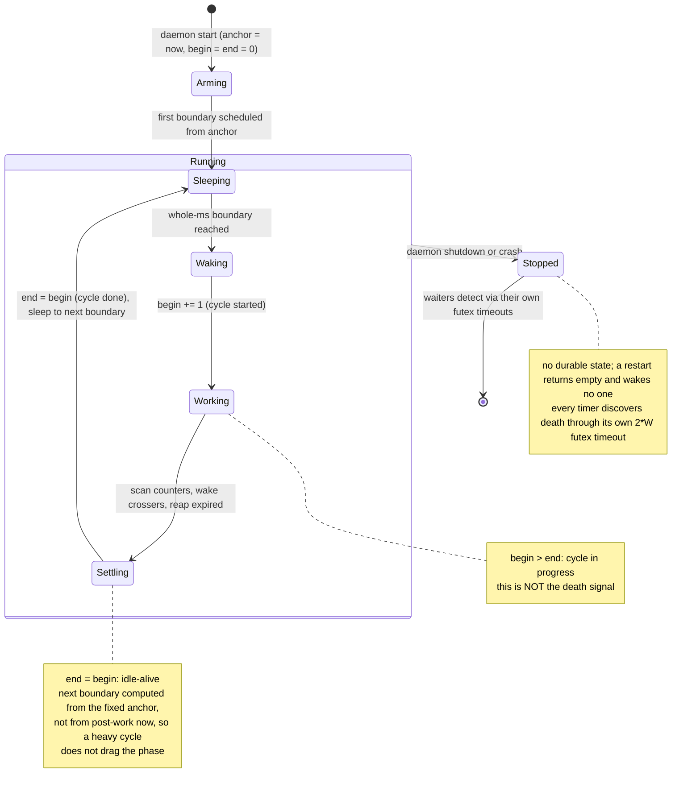

# System Clock State Machine

The system clock is a special interlock the daemon owns and advances on its 1 ms loop. Its `end`
counter is the millisecond count. `begin` advances at the start of each cycle, `end` at the end, so
`begin > end` means the daemon is mid-cycle. Timers are counters watching this interlock's counter.
It is the one interlock RF-RTS increments itself rather than handing to a consumer.

## State diagram

## Transitions

| From | To | Trigger | Guard / Precondition | Named condition on failure |
|------|----|---------|---------------------|---------------------------|
| (none) | Arming | daemon start | Capture the absolute anchor (`now`), initialize begin = end = 0. | (none) |
| Arming | Sleeping | schedule first | First boundary computed from the anchor. | (none) |
| Sleeping | Waking | boundary reached | The compensated sleep to the next whole-ms boundary returns. | (none) |
| Waking | Working | `begin += 1` | Mark the cycle started. Release semantics. | (none) |
| Working | Settling | do the work | Scan watched counters and wake waiters whose target was crossed; reap interlocks whose heartbeat expired. | (none) |
| Settling | Sleeping | `end = begin` | Mark the cycle done (idle-alive). Compute the next boundary from the fixed anchor, not from `now`. Sleep to it. | (none) |
| Running | Stopped | shutdown or crash | The daemon stops. No state is persisted. | (none) |
| Stopped | (gone) | waiters time out | Waiters discover the stop through their own futex timeouts, not through the clock. | (none) |

## Internal state

| Variable | Type | Description |
|----------|------|-------------|
| `begin` | atomic u64 | Cycle-started counter. Advanced at Waking. `begin > end` means mid-cycle. |
| `end` | atomic u64 | The millisecond count. Advanced at Settling. What timers watch. |
| `anchor` | u64 (monotonic ns) | The fixed reference the next boundary is computed from, so jitter does not accumulate. |

## Derived state

| Expression | Meaning |
|------------|---------|
| `begin > end` | Daemon is mid-cycle. Not a death signal. |
| `begin == end` | Daemon idle-alive between cycles. |
| `end` value | The current millisecond count; a timer's target is `end + W`. |

## Note on liveness

`begin > end` cannot distinguish a mid-cycle daemon from one that died mid-cycle, so it is not used
for death detection. Death is detected decentrally: each timer's futex wait times out at 2 times its
wait, and the SDK raises `RTSTimeout` on that timeout. The clock provides time, not liveness.
